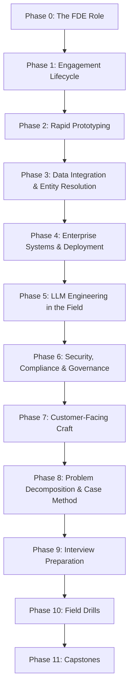

# Forward Deployed Engineering from Scratch

<p align="center">
  <b>130 lessons · 12 phases · 10 flagship builds · 12 field drills · 6 capstones · 150+ interview questions.</b><br>
  The complete discipline of the Forward Deployed Engineer: theory, interview prep,<br>
  and the real-world problems you will actually face at a customer site.
</p>

<p align="center">
  
  
  
  
  
</p>

---

## Why this curriculum exists

The Forward Deployed Engineer is the highest-leverage engineering role of the AI era. Palantir invented it; OpenAI, Anthropic, Scale, Sierra, Glean, and every serious enterprise-AI company now hires for it aggressively — because models are commoditizing while **deployment into messy, real enterprises is not**.

An FDE is not a consultant, not a sales engineer, not a normal SWE. You parachute into a customer's world — their broken CSVs, their 2009-era SOAP APIs, their compliance team, their skeptical VP — and ship working software against their real data in days, not quarters. The skill set is a specific braid of four strands:

1. **Full-stack speed** — a working demo before the second meeting.
2. **Data wrangling** — the real job is schema archaeology and entity resolution.
3. **Enterprise deployment** — SSO, VPCs, air-gaps, audit logs, DPAs.
4. **Customer craft** — discovery, decomposition, demos, and saying no.

No university teaches this braid. This repo does — from scratch.

**Every flagship lesson runs without an API key.** LLM-dependent lessons ship an inline `MockLLM` (deterministic, scriptable) so RAG, extraction, and eval harnesses are unit-testable on your machine. All code is Python stdlib only — nothing to install.

## The rules

1. **Real problems, not toy problems.** Every drill uses synthetically-generated *messy* data: duplicate customers, three date formats, Excel-mangled IDs, encoding disasters. Because that is the job.
2. **Self-testing.** Every flagship and drill solution asserts its own correctness. `python lesson.py` either passes or tells you exactly what broke.
3. **Interview-first theory.** Every theory lesson maps to questions actually asked in FDE loops (Palantir decomp, OpenAI forward-deployed, Anthropic applied AI, Scale, Sierra).
4. **Time-bound.** Lessons carry hour estimates; [ROADMAP.md](ROADMAP.md) has 6 / 12 / 18-week tracks.

## Lesson anatomy

| Beat | What it is |
|---|---|
| **PROBLEM** | The customer-site failure you hit without this skill, told as a war story |
| **INTUITION** | The design space and its trade-offs |
| **BUILD IT** | From-scratch implementation (flagships: runnable, self-testing Python) |
| **FIELD NOTES** | What changes with real customers: politics, timelines, data quality |
| **INTERVIEW ANGLE** | How this topic appears in FDE interview loops, with sample questions |
| **DRILL** | Extend the build, break it, fix it |

## Repository layout

```
phases/<NN>-<phase-name>/<NN>-<lesson-name>/
├── docs/en.md              # lesson narrative (6-beat)
└── code/lesson.py          # flagship lessons only — stdlib, self-testing
interview-bank/             # 150+ theory Qs, cases, take-homes, behavioral
problems/<NN>-<name>/       # field drills: generator + problem + solution
capstones/<NN>-<name>.md    # 6 capstone specs with milestones + rubrics
ROADMAP.md                  # 6 / 12 / 18-week timelines
website/                    # static study-tracker site
```

Run any flagship or drill: `python lesson.py` — Python 3.10+, no dependencies.

## Curriculum map



---

## Phase catalog

★ = flagship lesson with runnable, self-testing Python implementation.

### Phase 0 — Orientation: The FDE Role · Week 1 · 6 lessons · ~6h

| # | Lesson | hrs |
|---|--------|-----|
| 01 | What an FDE actually does: a week in the field | 1 |
| 02 | The role landscape: Palantir FDE/Delta/Echo, OpenAI, Anthropic, Scale, Sierra | 1 |
| 03 | FDE vs SWE vs solutions engineer vs consultant: the real boundaries | 1 |
| 04 | Why now: model commoditization and the deployment gap | 1 |
| 05 | The FDE career arc: IC field work → engagement lead → product boomerang | 1 |
| 06 | Setup & repo tour: how the drills, MockLLM, and flagships run | 1 |

### Phase 1 — The Engagement Lifecycle · Weeks 1–2 · 10 lessons · ~11h

| # | Lesson | hrs |
|---|--------|-----|
| 01 | Anatomy of an engagement: discovery → pilot → production → handoff | 1.5 |
| 02 | Discovery: finding the metric that gets renewal signed | 1 |
| 03 | Scoping: the pilot that proves value in 30 days | 1.5 |
| 04 | Time-to-value as the only KPI that matters | 1 |
| 05 | The data access battle: getting credentials before week 3 | 1 |
| 06 | Pilot design: seeded wins, visible dashboards, weekly demos | 1.5 |
| 07 | From pilot to production: the re-architecture conversation | 1 |
| 08 | Handoff: runbooks, training, and making yourself unnecessary | 1 |
| 09 | Failure modes: zombie pilots, champion churn, scope death spiral | 1 |
| 10 | Drill: write a 30-day pilot plan from a discovery transcript | 1.5 |

### Phase 2 — Rapid Full-Stack Prototyping · Weeks 2–3 · 12 lessons · ~15h

| # | Lesson | hrs |
|---|--------|-----|
| 01 | ★ CSV to working API in one file: stdlib http.server, zero deps | 2 |
| 02 | The demo-quality bar: what to fake, what must be real | 1 |
| 03 | Frontend in the field: one HTML file, no build step | 1.5 |
| 04 | SQLite as the pilot database: when it's enough (usually) | 1 |
| 05 | Throwaway vs keepable code: labeling your own tech debt | 1 |
| 06 | Seeded demo data: realistic, impressive, and safe | 1.5 |
| 07 | Feature flags for demos: one codebase, per-stakeholder views | 1 |
| 08 | The walking skeleton: end-to-end thin slice first | 1.5 |
| 09 | Excel is the UI: export, import, and living with it | 1 |
| 10 | Iteration cadence: shipping daily to a customer sandbox | 1 |
| 11 | Instrumenting the pilot: usage telemetry that proves value | 1.5 |
| 12 | Drill: build a one-file ops dashboard from a messy export | 1 |

### Phase 3 — Data Integration & Entity Resolution · Weeks 3–5 · 14 lessons · ~19h

| # | Lesson | hrs |
|---|--------|-----|
| 01 | ★ Schema inference from scratch: types, nulls, and lies | 2 |
| 02 | The messy CSV survival kit: encodings, delimiters, Excel damage | 1.5 |
| 03 | Date-format hell: 14 formats, one parser | 1 |
| 04 | Schema mapping: source → canonical, and who owns canonical | 1.5 |
| 05 | ★ Entity resolution I: normalization, blocking, exact match | 2 |
| 06 | Entity resolution II: fuzzy matching, scoring, survivorship | 1.5 |
| 07 | The ontology: modeling a customer's world as objects and links | 1.5 |
| 08 | ★ Incremental sync: change detection, watermarks, idempotent upserts | 2 |
| 09 | Connectors: SQL, REST, SFTP-with-a-nightly-CSV, and SAP | 1.5 |
| 10 | Data quality gates: quarantine, not rejection | 1 |
| 11 | Reconciliation: proving your numbers match their numbers | 1.5 |
| 12 | Pipeline orchestration from scratch: DAGs, retries, backfills | 1.5 |
| 13 | Lineage and auditability: where did this number come from | 1 |
| 14 | Drill: reconcile two systems that disagree by 3% | 1.5 |

### Phase 4 — Enterprise Systems & Deployment · Weeks 5–6 · 12 lessons · ~15h

| # | Lesson | hrs |
|---|--------|-----|
| 01 | Enterprise topology: where your code is allowed to run | 1 |
| 02 | Identity: SAML, OIDC, and "just use our Okta" | 1.5 |
| 03 | ★ JWT validation from scratch: what SSO actually hands you | 2 |
| 04 | Networking: VPCs, private links, proxies, and the firewall ticket | 1.5 |
| 05 | On-prem and air-gapped: shipping software you can't SSH into | 1.5 |
| 06 | Containers for the field: one image, three environments | 1 |
| 07 | Secrets management: from .env shame to vaults | 1 |
| 08 | Observability minimum: logs, health checks, and the 2am page | 1.5 |
| 09 | Databases you'll meet: Oracle, SQL Server, and the DBA who guards them | 1 |
| 10 | Release management: versioning pilots without breaking demos | 1 |
| 11 | The IT approval gauntlet: security review, ATO, procurement | 1 |
| 12 | Drill: write a deployment plan for a bank's VPC | 1 |

### Phase 5 — LLM Engineering in the Field · Weeks 6–8 · 14 lessons · ~19h

| # | Lesson | hrs |
|---|--------|-----|
| 01 | ★ RAG from scratch: chunking, TF-IDF retrieval, grounded answers | 2.5 |
| 02 | Chunking customer documents: PDFs, wikis, and 40-tab spreadsheets | 1.5 |
| 03 | Retrieval quality: why the demo worked and production doesn't | 1.5 |
| 04 | ★ Structured extraction: schemas, validation, retry-on-garbage | 2 |
| 05 | Prompting with customer context: glossaries, examples, taboos | 1 |
| 06 | ★ The eval harness: golden sets from real customer data | 2 |
| 07 | Hallucination control: grounding, citations, refusal design | 1.5 |
| 08 | Agents at customer sites: when tools touch production systems | 1.5 |
| 09 | Cost and latency budgets: the CFO reads the invoice | 1 |
| 10 | Model selection in the enterprise: hosted, VPC, on-prem weights | 1 |
| 11 | Guardrails: input filters, output filters, audit trails | 1.5 |
| 12 | Fine-tuning vs RAG vs prompting: the decision the customer asks for | 1 |
| 13 | Shipping accuracy honestly: confidence, human-in-the-loop, QA sampling | 1 |
| 14 | Drill: debug a RAG system that answers from the wrong contract | 1.5 |

### Phase 6 — Security, Compliance & Governance · Weeks 8–9 · 10 lessons · ~11h

| # | Lesson | hrs |
|---|--------|-----|
| 01 | The compliance alphabet: SOC 2, ISO 27001, HIPAA, GDPR, FedRAMP | 1.5 |
| 02 | Data classification: what you may see, store, and ship | 1 |
| 03 | ★ PII detection and redaction from scratch | 2 |
| 04 | DPAs and data residency: reading the contract you're bound by | 1 |
| 05 | Least privilege in the field: scoped credentials, break-glass | 1 |
| 06 | Audit logging: who saw what, when, and can you prove it | 1 |
| 07 | AI-specific governance: model cards, usage policies, the EU AI Act | 1.5 |
| 08 | Security questionnaires: answering the 300-row spreadsheet | 1 |
| 09 | Incident response when it's the customer's data | 1 |
| 10 | Drill: redact a customer dataset for use in a demo | 1 |

### Phase 7 — Customer-Facing Craft · Weeks 9–10 · 12 lessons · ~13h

| # | Lesson | hrs |
|---|--------|-----|
| 01 | Discovery interviews: questions that surface the real problem | 1.5 |
| 02 | Stakeholder mapping: champion, economic buyer, blocker, user | 1 |
| 03 | Requirements decomposition: from "make it smarter" to a backlog | 1.5 |
| 04 | Demo engineering: narrative arc, seeded data, recovery moves | 1.5 |
| 05 | Running the weekly: status, wins, risks, asks | 1 |
| 06 | Objection handling: "our data is different", "security won't allow it" | 1 |
| 07 | Saying no: scope control without losing the room | 1 |
| 08 | Working the org: IT, security, legal, and the intern who knows everything | 1 |
| 09 | Executive communication: the one-slide update | 1 |
| 10 | Escalation: when to burn a favor, when to eat the delay | 1 |
| 11 | Cross-cultural and remote fieldwork | 1 |
| 12 | Drill: turn a rambling stakeholder email into a scoped sprint | 1.5 |

### Phase 8 — Problem Decomposition & Case Method · Weeks 10–11 · 10 lessons · ~12h

| # | Lesson | hrs |
|---|--------|-----|
| 01 | The decomp interview: what Palantir actually tests | 1.5 |
| 02 | ★ Back-of-envelope engine: estimation with explicit error bars | 2 |
| 03 | Hypothesis trees: structuring an ambiguous problem in 5 minutes | 1 |
| 04 | Metric design: leading vs lagging, gameable vs honest | 1.5 |
| 05 | Data-model-first thinking: entities before features | 1 |
| 06 | The 80/20 solution: what you'd ship in week one | 1 |
| 07 | Trade-off narration: thinking aloud without rambling | 1 |
| 08 | Case walkthrough: hospital bed allocation | 1 |
| 09 | Case walkthrough: airline disruption recovery | 1 |
| 10 | Drill: three timed decomps with self-scoring rubric | 1.5 |

### Phase 9 — Interview Preparation · Weeks 11–12 · 12 lessons · ~14h

| # | Lesson | hrs |
|---|--------|-----|
| 01 | The FDE interview landscape: loops at Palantir, OpenAI, Anthropic, Scale, Sierra | 1 |
| 02 | Coding rounds: practical > leetcode — parsing, APIs, data munging | 1.5 |
| 03 | System design for FDEs: pilot architecture, not planet-scale | 1.5 |
| 04 | The take-home: patterns, time-boxing, and the README that wins | 1.5 |
| 05 | Decomp & case rounds: applying Phase 8 under pressure | 1 |
| 06 | Behavioral: STAR stories for customer conflict, ambiguity, speed | 1.5 |
| 07 | The demo round: presenting something you built | 1 |
| 08 | Questions to ask them: signal in both directions | 0.5 |
| 09 | Theory bank walkthrough I: data + systems questions | 1.5 |
| 10 | Theory bank walkthrough II: LLM + deployment questions | 1.5 |
| 11 | Theory bank walkthrough III: customer + judgment questions | 1 |
| 12 | Mock loop: full self-administered interview with rubrics | 1.5 |

### Phase 10 — Field Drills (Real-World Problem Sets) · Weeks 12–13 · 12 drills · ~18h

Graded, self-checking problems in [`problems/`](problems/). Each ships a data
generator (synthetic but realistically messy), a problem statement, and a
reference solution with assertions.

| # | Drill | Difficulty | hrs |
|---|-------|-----------|-----|
| 01 | The Excel-damaged customer master | ● | 1 |
| 02 | Three date formats, one timeline | ● | 1 |
| 03 | Deduplicate the CRM: 5,000 customers, ~18% dupes | ●● | 1.5 |
| 04 | Reconcile ERP vs bank statement | ●● | 1.5 |
| 05 | The nightly SFTP feed that sometimes doesn't arrive | ●● | 1.5 |
| 06 | Parse the legacy fixed-width mainframe export | ●● | 1.5 |
| 07 | Schema-map four subsidiaries into one canonical model | ●●● | 2 |
| 08 | Build the golden-set eval for a support-ticket classifier | ●● | 1.5 |
| 09 | Redact the dataset, keep it useful | ●● | 1.5 |
| 10 | The demo is in 4 hours: seed a convincing dataset | ●● | 1.5 |
| 11 | Debug the pipeline: numbers drifted 3% last Tuesday | ●●● | 2 |
| 12 | End-to-end: raw dumps → resolved entities → API → metrics | ●●● | 2 |

### Phase 11 — Capstones · Weeks 13–16 · 6 projects · ~40h

Specs in [`capstones/`](capstones/). Capstone 1 is the spine; 2–6 extend it.

| # | Capstone | What you build |
|---|----------|----------------|
| 01 | **Pilot-in-a-box** | Full engagement simulation: discovery transcript → 30-day plan → ingestion → dashboard → weekly demo script → handoff runbook |
| 02 | Entity-resolution engine | Production-grade dedup across three CRM extracts with survivorship rules and audit trail |
| 03 | RAG deployment with evals | Grounded Q&A over customer documents, golden-set evals, accuracy report |
| 04 | Legacy bridge | SOAP/fixed-width/CSV legacy system → clean modern API, incremental sync |
| 05 | Demo engineering kit | Seeded dataset + demo app + narrative script + failure-recovery plan |
| 06 | Production handoff pack | Monitoring, runbook, training deck, and the make-yourself-unnecessary checklist |

---

## Interview bank

[`interview-bank/`](interview-bank/) — the theory-interview core of this repo:

- **[theory-questions.md](interview-bank/theory-questions.md)** — 150+ questions with model answers, organized by topic (data, systems, LLM, deployment, security, judgment)
- **[case-interviews.md](interview-bank/case-interviews.md)** — decomp cases with full worked solutions
- **[take-home-patterns.md](interview-bank/take-home-patterns.md)** — the recurring take-home archetypes and how to win them
- **[behavioral.md](interview-bank/behavioral.md)** — FDE competency matrix + STAR story templates
- **[company-loops.md](interview-bank/company-loops.md)** — what each company's loop emphasizes

## License

MIT — see [LICENSE](LICENSE).
